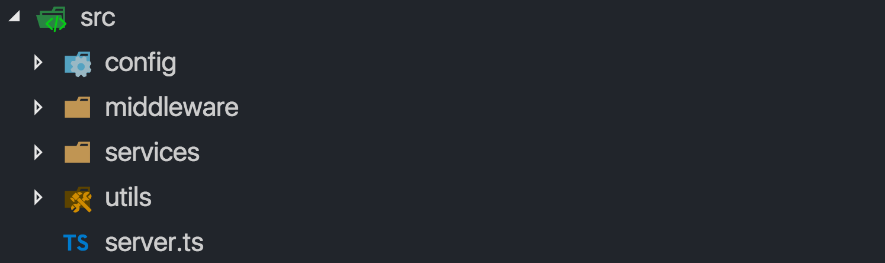
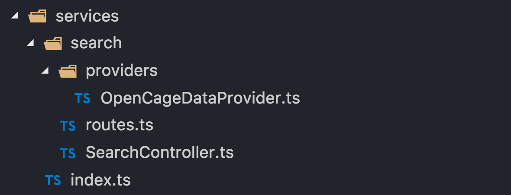
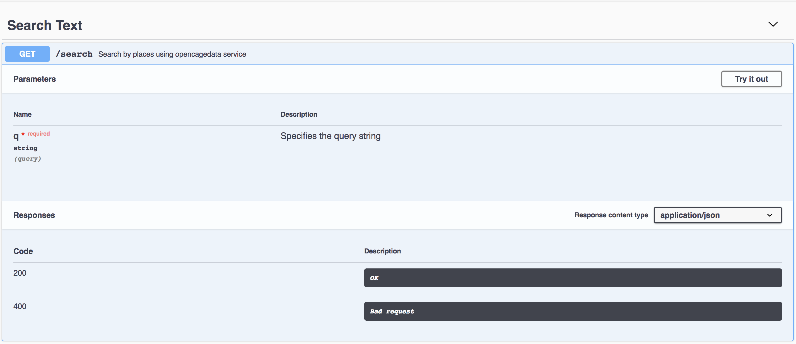

## Step 1.Initialize TypeScript Node.js project.

In late 2018 there are no excuses not to use TypeScript for Node, the setup is dead easy, so, let’s get started!

Let’s create a project folder and name our project search-api.

```
$ mkdir search-api
$ cd search-api
$ npm init -y
```

Next, install typescript along with tsc-watch for running our server every time source files have been changed.

```
npm i typescript tsc-watch
```

The solution with tsc-watch is elegant, it uses tsc -w under the hood, and once TS compiler has compiled all changes. It will restart our server.

Let’s change scripts section in package.json with this:

```
"scripts": {
   "dev": "tsc-watch --onSuccess \"node ./dist/server.js\""
}
```

Before we run it, we have to create a config for TypeScript compiler.

```
npx tsc --init --moduleResolution node --resolveJsonModule --target es6 --noImplicitAny --sourceMap --lib dom,es2017 --outDir dist
```

We use npx — an npm package runner for running locally, installed packages, tsc in our case. Now we have a tsconfig.json file in the project root directory.

By default, it watches all .ts files in the ./src folder and compiles it in ./dist folder. Also, ./node_modules will be excluded by default.

As a next step, we’ll create a server.ts file

```
mkdir src && touch ./src/server.ts
```
Let’s write a sum function and console.log it every second. Add this in the server.ts file.

```
const sum = (a: number, b: number) => a + b;
setInterval(() => console.log(sum(2, 3)), 1000);
```
Finally, everything is ready to run our command
```
npm run dev
```
It creates a ./dist folder where you can find a compiled server.js file. And in the terminal, you will see the new output every second. Try to change this code, and the result will be updated. This is all we need for using TS + Node together 😃.

As you can see we are not using nodemon here. The main reason is we don’t need it because ts-watch makes both compiling and restarting our server. Also using ts and nodemon together can be quite tricky.

## Step 2. Create a project structure with Express.js.

We also need a place for configuring a database, logger, redisClient, swagger. And we have to decide where and how to put our route/controllers/models. In this case, we will follow Project Structure Practices from Node.js Best Practices.

🔗 [**Read More: Node.js Best Practices**](https://github.com/cultureweb/nodebestpractices/blob/master/README.md)

Sound like quite a lot but is this that much? Let’s figure it out!
Run this command from root project directory:

```
mkdir ./src/config ./src/middleware ./src/services ./src/utils
```
The project structure will look like this:

<h1 align="center">
  
</h1>

<br/>
We have a services folder which contains independent subparts of the app like users, products, orders and so on. It’s going to be a search subfolder in our case. But before we jump on it let’s create the express server with some classy middleware.

Let’s install the latest express version. And then packages for managing CORS, compression for responses and TS types for Node from the root of the project:

```
npm i express@5.0.0-alpha.7 @types/express cors @types/cors compression @types/compression @types/node
```
Note that we need the newest express because it supports async/await, but it’s still an alpha. An alternative would be to use @awaitjs/express module.

Let’s create a basic web server now:

Note, that this code looks like 100% JavaScript. But it’s all typed, and TS won’t compile if there are any errors. For example, try to call new express() instead of express() and see what happens 😋.

Now we need to add our middleware. But instead of putting all them here let’s put it under middleware folder.

```
touch ./src/middleware/common.ts ./src/middleware/index.ts
```

A `common.ts` file contains the middleware like cors, compression and, the setup for body parsing. 
```
 
import { Router } from "express";
import cors from "cors";
import parser from "body-parser";
import compression from "compression";

export const handleCors = (router: Router) =>
  router.use(cors({ credentials: true, origin: true }));

export const handleBodyRequestParsing = (router: Router) => {
  router.use(parser.urlencoded({ extended: true }));
  router.use(parser.json());
};

export const handleCompression = (router: Router) => {
  router.use(compression());
};
```
Later we will add middleware for logging, security, caching and more. Paste it in `./middleware/common.ts`:

Here, you can finally see some difference. All our middleware wrappers accept express router class.

In `./middleware/index.ts` we will import all of middleware for providing a single connection point for our ***server.ts***. And we will put more stuff here in the future.

To apply our middleware, we will create a function which grabs this list of middleware and applies it on a router. But before we need an index.ts file in `./utils folder`, so let’s create it.

```
touch ./src/utils/index.ts
```

```
import { Router } from "express";

type Wrapper = ((router: Router) => void);

export const applyMiddleware = (
  middleware: Wrapper[],
  router: Router
) => {
  for (const f of middleware) {
    f(router);
  }
};
```

The applyMiddleware helper accepts the list of middleware wrappers we define in `./middleware/index.ts` and ***express.Router***. Now everything is ready for using it in `server.ts`:

A nice thing about it is as we’re adding more and more middleware we don’t have to change this code. Only create its file under `./middleware` and import it in `./middleware/index.ts`. 

Now we need something similar for routing. Let’s add a basic routing for our search service.

```
mkdir ./src/services/search && touch ./src/services/search/routes.ts && touch ./src/services/index.ts
```

In `./services/index.ts` add this:

```
import searchRoutes from "./search/routes";

export default [...searchRoutes];
```
Now, we have to apply this declaratively specified route on our router, in `./utils/index.ts`.

```
import { Router, Request, Response, NextFunction } from "express";

type Wrapper = ((router: Router) => void);

export const applyMiddleware = (
  middlewareWrappers: Wrapper[],
  router: Router
) => {
  for (const wrapper of middlewareWrappers) {
    wrapper(router);
  }
};

type Handler = (
  req: Request,
  res: Response,
  next: NextFunction
) => Promise<void> | void;

type Route = {
  path: string;
  method: string;
  handler: Handler | Handler[];
};

export const applyRoutes = (routes: Route[], router: Router) => {
  for (const route of routes) {
    const { method, path, handler } = route;
    (router as any)[method](path, handler);
  }
};
```
applyRoutes function is a place where we’re adding all our route to an express router instance created in `server.ts`. Now let’s open this file and change with a line:
```
import { applyMiddleware } from "./utils";
```
with this
```
import { applyMiddleware, applyRoutes } from "./utils";
import routes from "./services";
```
and add this call right after applyMiddleware(middleware, router):
```
applyMiddleware(middleware, router);
applyRoutes(routes, router);
```
Once it’s done, it allows us to quickly add new functionality under `./service` directory, and all we have to do is to import their routes in `./service/index.ts`.

Great! Now let’s add error handling and more middleware.

## Step 3. Error handling with Node.js and Express.

This step can be quite exhausting. We have to think carefully about each type of error. It includes client and server errors, sync and async, uncaught exceptions and unhandled promise rejections.

Having a robust error handling allows us to focus on solving our actual task and be sure it’s all aren’t going to fall apart miserably. Because we had no time to think enough about how to catch all these errors.

Our goal here is to implement the most critical parts of Error Handling Practices. What we have to think about:

#### 1. Catch uncaughtException and unhandledRejection.

#### 2. Distinguish client errors vs server errors.

#### 3. Catch both sync and async errors, throw an exception.

#### 4. Create a dedicated ErrorHandler class available for unit-testing.

Handling both uncaughtException and unhandledRejection is super important. If you face with any of these is pretty much game over for this node instance - now your app is in an undefined state. The best thing is to kill this instance and spawn a new one. Tools like forever or pm2 can do it for us. We’ll introduce pm2 later. For now, let’s add handlers for uncaughtException and uncaughtException events.

Let’s update our `./server.ts` file, add these lines after the import section.

```
process.on("uncaughtException", e => {
  console.log(e);
  process.exit(1);
});
process.on("unhandledRejection", e => {
  console.log(e);
  process.exit(1);
});
```
Later we will replace console.log with a logger instance.

Now you can think about handling client and server errors. First, let’s create errorHandlers middleware:
```
touch ./src/middleware/errorHandlers.ts
```
Now, let’s add it to our `errorHandlers.ts`:

```
import { Request, Response, NextFunction, Router } from "express";
import { HTTPClientError, HTTP404Error } from "../utils/httpErrors";

const handle404Error = (router: Router) => {
  router.use((req: Request, res: Response) => {
    throw new HTTP404Error("Method not found.");
  });
};

const handleClientErrors = (router: Router) => {
  router.use((err: Error, req: Request, res: Response, next: NextFunction) => {
    if (err instanceof HTTPClientError) {
      console.error(err);
      res.status(err.status).send(err.message);
    } else {
      next(err);
    }
  });
};

const handleServerErrors = (router: Router) => {
  router.use((err: Error, req: Request, res: Response, next: NextFunction) => {
    console.error(err);
    if (process.env.NODE_ENV === "production") {
      res.status(500).send("Internal Server Error");
    } else {
      res.status(500).send(err.stack);
    }
  });
};

export default [handle404Error, handleClientErrors, handleServerErrors];
```
We have three different error handlers for each use case:

1. **handle404Error** the way you handle 404 in express. By adding a fallback middleware if nothing else was found.

2. **handleClientErrors** catches client API errors like Bad request or Unauthorized.

3. **handleServerErrors** a place where we handle “Internal Server Error”.

Some things to spot:

1. We don’t handle 404 error in its middleware — we directly propagate it further for a dedicated client errors handler.

2. Next in the chain — handleClientErrors. We’re interested only in 4xx HTTP errors and if it’s not a case we propagate it down the chain.

3. Finally handleServerErrors — our last resort for handling errors, we must handle it here, or uncaughtException handler will be called, and this node process will be finished.

This is a workable example. But, we tied up together the express middleware for error handling and specific logic for each type of errors. This makes it pretty much impossible for unit-testing and replacing the error handling strategy. Let’s extract this logic from our middleware file. First, create a ErrorHandler.ts file:

```
touch ./src/utils/ErrorHandler.ts
```
And add the code below to our `./utils/ErrorHandler.ts`:

```
import { Response, NextFunction } from "express";
import { HTTPClientError, HTTP404Error } from "../utils/httpErrors";

export const notFoundError = () => {
  throw new HTTP404Error("Method not found.");
};

export const clientError = (err: Error, res: Response, next: NextFunction) => {
  if (err instanceof HTTPClientError) {
    console.warn(err);
    res.status(err.statusCode).send(err.message);
  } else {
    next(err);
  }
};

export const serverError = (err: Error, res: Response, next: NextFunction) => {
  console.error(err);
  if (process.env.NODE_ENV === "production") {
    res.status(500).send("Internal Server Error");
  } else {
    res.status(500).send(err.stack);
  }
};
```
and let’s update `./middleware/errorHandlers.ts`:

```
import { Request, Response, NextFunction, Router } from "express";
import * as ErrorHandler from "../utils/ErrorHandler";

const handle404Error = (router: Router) => {
  router.use((req: Request, res: Response) => {
    ErrorHandler.notFoundError();
  });
};

const handleClientError = (router: Router) => {
  router.use((err: Error, req: Request, res: Response, next: NextFunction) => {
    ErrorHandler.clientError(err, res, next);
  });
};

const handleServerError = (router: Router) => {
  router.use((err: Error, req: Request, res: Response, next: NextFunction) => {
    ErrorHandler.serverError(err, res, next);
  });
};

export default [handle404Error, handleClientError, handleServerError];
```
Now, we have a dedicated object which encapsulates the whole logic HOW we manage it. 

Next thing — let’s create a couple of dedicated HTTP4xxError classes which we will use in controllers’ code.
First, create a `httpErrors.ts file`:
```
touch ./src/utils/httpErrors.ts
```
Paste this code in `httpErrors.ts` for HTTPClientError abstract class. It formats the message which can be digested by built-in Error object.
```
export abstract class HTTPClientError extends Error {
  readonly statusCode!: number;
  readonly name!: string;

  constructor(message: object | string) {
    if (message instanceof Object) {
      super(JSON.stringify(message));
    } else {
      super(message);
    }
    this.name = this.constructor.name;
    Error.captureStackTrace(this, this.constructor);
  }
}
```
And, then code for HTTP400Error and HTTP404Error classes:
```
export class HTTP400Error extends HTTPClientError {
  readonly statusCode = 400;

  constructor(message: string | object = "Bad Request") {
    super(message);
  }
}

export class HTTP404Error extends HTTPClientError {
  readonly statusCode = 404;

  constructor(message: string | object = "Not found") {
    super(message);
  }
}
```
We can use it then like: ***throw new HTTP400Error()*** and error object will contain both ***statusCode*** and message. We cannot change a ***statusCode*** field. However we can pass another string as a message or an object. Which is very neat for libraries like [**class-validator**](https://github.com/typestack/class-validator) which we will use later example:
```
throw new HTTP400Error({message: 'password is too short'})
```
Error handlers are quite a specific type of middleware . Usually, we inject middleware before handling user routes. But for error handling — after, when something bad has happened in our controller. Or if threw an exception and wanted to catch it by our error handlers middleware.

That said let’s update `./src/server.ts`:

```
import http from "http";
import express from "express";
import { applyMiddleware, applyRoutes } from "./utils";
import middleware from "./middleware";
import errorHandlers from "./middleware/errorHandlers";
import routes from "./services";

process.on("uncaughtException", e => {
  console.log(e);
  process.exit(1);
});

process.on("unhandledRejection", e => {
  console.log(e);
  process.exit(1);
});

const router = express();
applyMiddleware(middleware, router);
applyRoutes(routes, router);
applyMiddleware(errorHandlers, router);

const { PORT = 3000 } = process.env;
const server = http.createServer(router);

server.listen(PORT, () =>
  console.log(`Server is running http://localhost:${PORT}...`)
);
```
Now we can enjoy it and see how it’s easy to create a controller and handle errors automatically!

## Step 4. Create a search service.
Now using the skeleton we’ve created let’s create a search API. It‘s dead simple:

1. It provides an API endpoint like ?q=someplace

2. It makes a request to OpenCage Geocoder, receives data and sends it back to users.

First, let’s create the following structure for our search service:
<h1 align="center">
  
</h1>

<br/>
By running these set of commands
```
mkdir ./src/services/search/providers
```
```
touch ./src/services/search/providers/OpenCageDataProvider.ts
```
```
touch ./src/services/search/SearchController.ts
```
For now, we create only one provider — dataProvider. But we can include many more and combine the result in SearchController.

We will use ***request-promise*** module for requesting to opencagedata geocoder. It supports async/await syntax, so let’s install it:

```
npm i request request-promise @types/request-promise
```
Let’s write a function for getting data, open `./search/provider/OpenCageDataProvider.ts` and paste it:
```
import request from "request-promise";
import dotenv from "dotenv";

dotenv.config();

export const getPlaces = async (query: string) => {
  const key = process.env.OPEN_CAGE_DATA_KEY;
  const url = `https://api.opencagedata.com/geocode/v1/geojson?q=${query}&key=${key}&limit=20&no_annotations=1`;
  const response = await request(url);
  return JSON.parse(response);
};
```
Here are a few points worth paying attention to:

1. we’re using **OPEN_CAGE_DATA_KEY** environment variable, we don’t want to expose any credentials in our source code.

2. We aren’t handling errors here with ***try/catch***. We use our dedicated middleware for that.

For using environment variables install dotenv module:
```
npm i dotenv @types/dotenv
```
Now let’s create `.env` in a root directory file and add there this variable (or rename `.env.example` to `.env` in source code)

```
touch .env
```
and paste it here:
```
OPEN_CAGE_DATA_KEY=8c0892514e884f09af7c09a9b067b02b
```
`./search/SearchController.ts` is simply calling our provider.

```
import { getPlaces } from "./providers/OpenCageDataProvider";

export const getPlacesByName = async (q: string) => {
  if (q.length < 3) {
    return {
      type: "FeatureCollection",
      features: []
    };
  }

  return await getPlaces(q);
};
```
Next, code for our ./search/route.ts:
```
import { Request, Response } from "express";
import { getPlacesByName } from "./SearchController";

export default [
  {
    path: "/api/v1/search",
    method: "get",
    handler: [
      async ({ query }: Request, res: Response) => {
        const result = await getPlacesByName(query.q);
        res.status(200).send(result);
      }
    ]
  }
];
```

We are making an endpoint available at `http://localhost:3000/api/v1/search?q=Berlin`. Next, our handler is very simple. We provide a string query to our controller, waiting for the result and send it to the user. This is very important — we don’t want to provide the request and response objects for the controller. It makes our code much harder to unit-test. And more important our controller turning into a god object. Which knows everything this both request and response objects.

## Step 5. Add more cool stuff: custom error checking and api documentation with Swagger.

In this step, we will focus on:

1. Handle a missing ?q parameter error
2. Use swagger for documenting the endpoint

Instead of adding a check somewhere in our controller’s code we’ll create a unique middleware for that. Create a `./middleware/checks.ts` file 
```
touch ./src/middleware/checks.ts
```
And add this code:

```
import { Request, Response, NextFunction } from "express";
import { HTTP400Error } from "../utils/httpErrors";

export const checkSearchParams = (
  req: Request,
  res: Response,
  next: NextFunction
) => {
  if (!req.query.q) {
    throw new HTTP400Error("Missing q parameter");
  } else {
    next();
  }
};
```
Here we’re only checking the existence of **‘q’** parameter and throwing an exception if it’s missing. Thanks to our **error handling middleware**, we will catch it there!

Let’s add this middleware in `./search/route.ts`:
```
import { Request, Response } from "express";
import { getPlacesByName } from "./SearchController";
import { checkSearchParams } from "../../middleware/checks";

export default [
  {
    path: "/api/v1/search",
    method: "get",
    handler: [
      checkSearchParams, // <-- this line
      async ({ query }: Request, res: Response) => {
        const result = await getPlacesByName(query.q);
        res.status(200).send(result);
      }
    ]
  }
];
```
This approach scales quite well. We can chain things like checking authorization, add caching and many more.

For now, we have an endpoint with a specific URL structure and error codes. Time to introduce swagger for documenting our API. This is how it’s going to look like:


<h1 align="center">
  
</h1>

<br/>
We will use swagger-ui-express as middleware to provide documentation `http://localhost:3000/api-docs`, so let’s install this module:
```
npm i swagger-ui-express @types/swagger-ui-express
```
Then create a swagger.json file under `./src/config` folder by running:
```
touch ./src/config/swagger.json
```
Now in `swagger.json`, we will document our endpoint:

```
{
    "swagger": "2.0",
    "info": {
      "version": "1.0.0"
    },
    "host": "localhost:3000",
    "basePath": "/api/v1",
    "schemes": ["http"],
    "produces": ["application/json"],
    "paths": {
      "/search": {
        "get": {
          "tags": ["Search Text"],
          "summary": "Search by places using opencagedata service",
          "responses": {
            "200": {
              "description": "OK"
            },
            "400": {
              "description": "Bad request"
            }
          },
          "content": {
            "application/json": {}
          },
          "parameters": [
            {
              "name": "q",
              "in": "query",
              "description": "Specifies the query string",
              "required": true,
              "type": "string"
            }
          ]
        }
      }
    }
  }
  ```
  And to make it work let’s create middleware for that, run:
  ```
  touch ./src/middleware/apiDocs.ts
  ```
  And add this code:
  ```
import { Router } from "express";
import swaggerUi from "swagger-ui-express";
import swaggerDocument from "../config/swagger.json";

export const handleAPIDocs = (router: Router) =>
  router.use("/api-docs", swaggerUi.serve, swaggerUi.setup(swaggerDocument));
```
As the last step let’s import this middleware wrapper in `./middleware/index.ts`:
```
import {
  handleCors,
  handleBodyRequestParsing,
  handleCompression
} from "./common";

import { handleAPIDocs } from "./apiDocs";

export default [
  handleCors,
  handleBodyRequestParsing,
  handleCompression,
  handleAPIDocs
];
```
This is it! Now it’s available here:` http://localhost:3000/api-docs`. Hit ***‘try it out’*** button, and you can play with it.

It's time to focus on things which block us to deploy it in production — lack of tests, clustering, and production configuration.

## Step 6. Configure Unit-testing with Jest.

We’re going to create tests for each part of the service: our controller, route, and provider. [**Here**]('https://basarat.gitbooks.io/typescript/docs/testing/jest.html') you can find excellent instruction for using Jest with TypeScript. We will cover the basics of it.

First, let’s install it:
```
npm i jest @types/jest ts-jest -D
```
We’re installing ts-jest along with jest. It allows ***jest*** to transpile TypeScript on the fly. A flag **‘-D’** installs it as a dev dependency.

Second, add **‘jest’** section in package.json:
```
"jest": {
  "verbose": true,
  "transform": {
    "^.+\\.tsx?$": "ts-jest"
  },
  "testRegex": "(/__tests__/.*|(\\.|/)(test|spec))\\.(jsx?|tsx?)$",
  "moduleFileExtensions": [
    "ts",
    "tsx",
    "js",
    "jsx",
    "json",
    "node"
  ]
},
```
And finally, add **‘test’** command in scripts section, replace it with the next:
```
"scripts": {
  "dev": "tsc-watch --onSuccess \"node ./dist/server.js\"",
  "test": "jest --coverage --verbose"
},
```
Note, we pass **‘ — coverage’ flag —** it indicates that test coverage information should be collected and reported in the output.

Now we are ready for running jest:

```
npm run test
```
If we have done all the steps correctly, you will see **‘No tests found’** error. Which is great! Now we are ready for actually creating tests.

## Step 7. Adding Unit-Tests.

We need tests for three different pieces of our service: routes, controller, and provider. Let’s start with the last one — the most low level here. Our provider is responsible for requesting to 3rd party service — [**opencagedata.com**]('https://opencagedata.com/').

Unit-tests should be fast by definition which means we have to mock the real request with fake data. We want to test things we control and want to mock the rest we don’t.

Moreover, we have to think about proper error handling . What if the real service is not available and returns ***503 error***. Having test coverage, in this case, makes our lives more comfortable in the future.

### Let’s get started.

First, let’s create a unit-test file for our: ***OpenCageDataProvider***.

```
touch ./src/services/search/providers/OpenCageDataProvider.test.ts
```
We are going to test ***getPlaces*** function from ***OpenCageDataProvider*** module, copy the following code to the file we’ve just created:
```
import request from "request-promise";
import * as Provider from "./OpenCageDataProvider";

jest.mock("request-promise");

describe("OpenCageDataProvider", () => {
  test("an empty query string", async () => {
    (request as any).mockImplementation(() => '{"features": []}');
    const result = await Provider.getPlaces("Paris");
    expect(result).toEqual({ features: [] });
  });
});
```
Here, we first mock the whole request-promise module. And then we’re ***mocking an implementation*** of request function which is used inside our getPlaces function. If you feel shaky about the statement above [***this article***]('https://medium.com/@rickhanlonii/understanding-jest-mocks-f0046c68e53c') is definitely will help!

In this example, we’re testing an empty query, and as well as the original service, it should return a valid JSON object as a string. An empty string is the only corner case here: with TypeScript, **we don’t need tests for inputs like:**

`Provider.getPlaces(false)`
`Provider.getPlaces(0)`
`Provider.getPlaces({})`

It simply won’t compile! This is just great — **TypeScript helps us to cover our methods with MUCH less code.** It feels so good.

But what if the real service is not available or the response is not a valid JSON string? Let’s add a test for checking this exception:

A lot of stuff is going on in only two lines:
```
import request from "request-promise";
import * as Provider from "./OpenCageDataProvider";

jest.mock("request-promise");

describe("OpenCageDataProvider", () => {
  test("an empty query string", async () => {
    (request as any).mockImplementation(() => '{"features": []}');
    const result = await Provider.getPlaces("Paris");
    expect(result).toEqual({ features: [] });
  });

  test("an invalid non-json response", async () => {
    (request as any).mockImplementation(() => "Service Unavailable.");
    await expect(Provider.getPlaces("Chamonix")).rejects.toThrow(SyntaxError);
  });
});
```
1. Here again, we use mockImplementation. But this time it returns **‘Service Unavailable.’** string.
2. Secondly rejects helps us to test a thrown exception ***SyntaxError***. This is an error which occurs when we provide an invalid argument for ***JSON.parse*** function.
3. And finally, we have to put ***await*** keyword before expect. Since this test is asynchronous and Jest has to wait till it finishes.

**An exercise:** try to create unit-tests for SearchController on your own. It’s not going to be that different from what we’ve created now.

## Step 8. Next Level: Adding Integration Tests with Supertest.

Unit tests are important, but when it comes to developing API, we badly need tests for our API endpoints. I’m getting tired very quickly to check Postman every time I change something in the code.

We will use [***supertest***]('https://github.com/visionmedia/supertest') as an integration test tool. There are a couple of benefits which makes it super appealing to use:

1. It’s very easy to use, it can’t be any simpler than that.

2. Works nicely with Jest.

First, let’s install ***supertest***:
```
npm i supertest @types/supertest
```
Then, we’re creating `routes.test.ts` file:
```
touch ./src/services/search/routes.test.ts
```
Now, let’s add this code in `routes.test.ts`:

```
import express, { Router } from "express";
import request from "supertest";
import { applyMiddleware, applyRoutes } from "../../utils";
import promiseRequest from "request-promise";
import middleware from "../../middleware";
import errorHandlers from "../../middleware/errorHandlers";
import routes from "../../services/search/routes";

jest.mock("request-promise");
(promiseRequest as any).mockImplementation(() => '{"features": []}');

describe("routes", () => {
  let router: Router;

  beforeEach(() => {
    router = express();
    applyMiddleware(middleware, router);
    applyRoutes(routes, router);
    applyMiddleware(errorHandlers, router);
  });

  test("a valid string query", async () => {
    const response = await request(router).get("/api/v1/search?q=Cham");
    expect(response.status).toEqual(200);
  });
  ```
  This is so simple! Let’s go throughout this code:

1. Again, we mock request-promise, we don’t want to make a network request.

2. We create an express router and apply all middleware, routes, and error handlers the same way we did it in our `server.ts`.

3. We use request function from the supertest module. Note, we don’t create an HTTP server. We only provide an Express router and supertest creates it internally. Then makes a GET request with our data.

4. We’ve got a `response` object which contains both data and a status code.

As you can see, **creating integration tests** for the API is not any complex than unit tests for our provider. But, this time we test the whole chain of middleware, routes, and error handlers!

As the last step, we can add integration tests for invalid queries:

add this code in `routes.test.ts`:

```
test("a non-existing api method", async () => {
    const response = await request(router).get("/api/v11/search");
    expect(response.status).toEqual(404);
  });
  
  test("an empty string", async () => {
    const response = await request(router).get("/api/v1/search?q=");
    expect(response.status).toEqual(400);
  });
```
Also, the huge plus of supertest is readability — we can see what we pass and what the result is. Tests give us the confidence and now we can move on!

## Step 9. Clustering our API with PM2

You might know, the Node.js event loop uses only one core of a processor to execute its code. Node.js has a cluster module to spawn child processes — worker processes. They all share the same port.

But instead of spawning processes directly with the cluster module we will use [**PM2 — Process Manager for Node.js**]('https://pm2.io/runtime/'). It has great features like a load balancing and auto-restarting node instances.

### Installation

**PM2** is a node package, let’s install it as a local dependency:

```
npm i pm2
```
Now we have to configure the PM2 `.yaml` process file:

- Specify how many instances we want to create.
- The script which will be executed to start an app
- Set the exec_mode to ***cluster***, so **PM2** know we want to load balance between each instance.

Let’s create a `pm2.yaml` file:

```
touch pm2.yaml
```
And paste the following code:
```
apps:
  - script: ./dist/server.js
    instances: max
    exec_mode: cluster
```
Finally, we have to add a command for running PM2 process file. Add the line below in the scripts section in our **package.json**:

```
"start": "npx pm2 start pm2.yaml"
```
Now the scripts section looks like this:
```
"scripts": {
  "dev": "tsc-watch --onSuccess \"node ./dist/server.js\"",
  "start": "npx pm2 start pm2.yaml",
  "test": "jest"
}
```
There a few more things we have to do before we can run our production-ready service:

- Compile .ts source files into the ./dist folder, so PM2 will be able to run our `./dist/server.js file`.

- Specify NODE_ENV to production.

Actually, when we execute `npm run dev`, we already create the ./dist folder. But we‘re making it through the development process but what if our colleague wants only npm clone and run it?

The fastest way is to add an npm postinstall hook. It runs every time after `npm install` execution. All we have to do — run TypeScript compiler with our options, let’s add this hook in our `package.json`. Update the scripts section with it:

```
"scripts": {
  "postinstall": "npx tsc",
  "dev": "tsc-watch --onSuccess \"node ./dist/server.js\"",
  "start": "npx pm2 start pm2.yaml",
  "test": "jest --coverage --verbose"
}
```
And last but not least, we have to force all our dependencies, to use production mode. For example, [**it will boost the express.js performance up to 3 times!**]('https://www.dynatrace.com/news/blog/the-drastic-effects-of-omitting-node-env-in-your-express-js-applications/')

Let’s add this line to our .env file:
```
NODE_ENV=production
```
Now, for starting Node.js in production all we have to do is to run:
```
npm run start
```